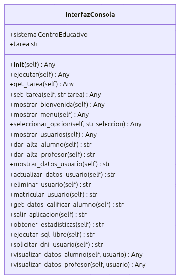

# Sistema de Gestión de un Centro Educativo

## Descripción del proyecto
Esta aplicación es un **Sistema de Gestión de un Centro Educativo** desarrollado en **Python**. Su objetivo principal es modelar de forma progresiva la lógica de negocio de una institución escolar, permitiendo administrar tanto al personal docente como al alumnado.

### Funcionalidades
El sistema destaca por las siguientes funcionalidades implementadas:
- Gestión de usuarios: Permite la creación y almacenamiento de alumnos y profesores.
- Gestión de Asignaturas: Los alumnos pueden ser matriculados y es posible asignar o modificar sus calificaciones de forma dinámica.
- Modelo de Herencia y Polimorfismo: Utiliza una clase base abstracta Persona de la que heredan los distintos roles, permitiendo un tratamiento unificado de los datos pero con comportamientos específicos para cada tipo de usuario (por ejemplo, en su representación de texto __str__).
- Gestión Académica:
  * Matriculación: Los alumnos pueden ser matriculados en diferentes asignaturas.
  * Calificación: El sistema permite asignar notas a los alumnos validando que se encuentre la nota en el rango de 0 a 10 y debe ser realizada por el profesor con la especialidad en esa asignatura.
- Sistema de Validación Robusto: 
  * Control estricto de DNIs (formato 8 números + 1 letra).
  * Validación de rango de calificaciones (0-10).
  * DNIs únicos: verificacion en la creación/modificación del usuario asi como bloqueo en base de datos asignado como `UNIQUE` el campo dni.
  * Email únicos: verificacion en la creación/modificación del usuario asi como bloqueo en base de datos asignado como `UNIQUE` el campo email.
- Gestión de Excepciones: Implementación de errores personalizados (`DatoInvalido`, `Duplicado`,`BaseDeDatosError`) que permiten al programa continuar su ejecución ante datos corruptos, entradas duplicadas, errores en base de datos informando del error por consola y registrando en el log tales errores.
- Persistencia de Datos: Los datos de alumnos, profesores y asignaturas se almacenan en una base de datos mysql alojada en un contenedor docker, permitiendo que la información se mantenga entre distintas ejecuciones del programa.
- Operaciones CRUD Completas: Se ha implementado la capacidad de Crear, Leer, Actualizar y Borrar tanto para el personal docente como para el alumnado.
- Sistema de Logging: Registro automático de cada operación (altas, bajas, errores) en el archivo escuela.log, incluyendo marca de tiempo y estado de la tarea así como los errores que se producen durante la ejecución.
- Suite de pruebas para verificación de la lógica de negocio.

## Arquitectura y Modelo de Clases (UML)
El diseño del software se basa en una **arquitectura modular organizada en capas**, siguiendo principios de alta cohesión y bajo acoplamiento. Esta estructura permite separar la lógica de presentación de la lógica de negocio y la persistencia, facilitando el mantenimiento evolutivo del sistema.

### Descripción de la Arquitectura

1.  **Capa de Presentación (`interfaz_usuario`)**: Gestiona la interfaz de usuario por consola, validando entradas y enviando peticiones al orquestador.
2.  **Capa de Negocio (`escuela.gestion`)**: Actúa como el núcleo del sistema (Clase `CentroEducativo`), donde se coordina la lógica operativa y el flujo de datos entre modelos y base de datos.
3.  **Capa de Persistencia (`escuela.db_manager`)**: Encargada de la comunicación con el servidor MySQL mediante consultas SQL parametrizadas.
4.  **Capa de Dominio (`escuela.modelos`)**: Define las entidades del sistema utilizando una jerarquía de clases.
5.  **Servicios Transversales (`common`, `registrar`)**: Proveen utilidades globales como validaciones, excepciones personalizadas y trazabilidad mediante logs.


### Diagramas de Clase

#### 1. Interfaz de Usuario
Gestor de la lógica visual y navegación de menús mediante la interacción por consola.



#### 2. Centro Educativo (Lógica de Negocio)
Orquestador principal que centraliza las operaciones de gestión de alumnos, profesores y procesos de matriculación.


#### 3. DB Manager (Persistencia)
Implementación del patrón DAO (*Data Access Object*) para la gestión de transacciones SQL y conectividad con MySQL.


#### 4. Modelos de Datos
Representa la jerarquía de entidades. Se destaca el uso de **herencia** a partir de la clase base `Persona` y la composición con la clase `Asignatura`.


#### 5. Utilidades y Excepciones (Common)
Define el sistema de errores personalizados para el control de la lógica de negocio y métodos de validación comunes.


#### 6. Registro de Logs
Subsistema encargado de la trazabilidad de operaciones y gestión de errores en tiempo de ejecución.


## Estructura del proyecto
```
└── 📁gestion-escolar-python
    └── 📁app
        ├── __init__.py           # Facilita las importaciones del paquete
        ├── interfaz_usuario.py   # Gestor logica visual y conexion a centro educativo
    └── 📁escuela
        └── 📁tests
            ├── test_centro.py    # Suite de pruebas automatizadas
        ├── __init__.py           # Paquete principal de lógica de negocio
        ├── common.py             # Utilidades, excepciones personalizadas y validaciones
        ├── db_manager.py         # Gestor base de datos: capa de persistencia (MySQL Connector)
        ├── gestion.py            # Orquestador (Clase CentroEducativo)
        ├── modelos.py            # Entidades (Persona, Alumno, Profesor, Asignatura)
        ├── registrar.py          # Configuración de logging
    └── 📁images                  # Recursos visuales para documentación
    └── 📁scripts
        ├── init_db.sql           # Script de creación de tablas y datos iniciales
    ├── .gitignore                # Archivos excluidos de control de versiones
    ├── docker-compose.yml        # Orquestación del contenedor MySQL
    ├── escuela.log               # Logs de la aplicacion
    ├── main.py                   # Punto de entrada principal de la aplicación
    ├── README.md                 # Documentación de la aplicación
    └── requirements.txt          # Dependencias (mysql-connector, coverage, etc.)
```

## Tecnologías y Conceptos Aplicados

* **Programación Orientada a Objetos (POO) Avanzada**:
    * **Herencia y Polimorfismo**: Implementación de una jerarquía de clases con `Persona` como base y especialización en `Alumno` y `Profesor`, permitiendo un tratamiento uniforme de las entidades.
    * **Encapsulamiento**: Protección del estado interno de los objetos mediante atributos privados y acceso controlado a través de métodos *getter* y *setter*.
* **Capa de Persistencia y Bases de Datos**:
    * **MySQL Relacional**: Diseño de un esquema de base de datos con relaciones de clave foránea (Foreign Keys) para gestionar alumnos, profesores, asignaturas y matrículas.
* **Arquitectura de Software**:
    * **Patrón de Capas**: Separación clara entre la interfaz de usuario (presentación), la lógica de negocio (CentroEducativo) y la gestión de datos (DBManager).
* **Robustez y Mantenibilidad**:
    * **Gestión de Excepciones Personalizadas**: Sistema de control de errores propio (`DatoInvalido`, `Duplicado`, `BaseDatosError`) para capturar fallos lógicos antes de que lleguen a la capa de persistencia.
    * **Logging**: Registro sistemático de eventos y errores mediante el módulo `logging` de Python para facilitar la trazabilidad.
* **Infraestructura y Calidad**:
    * **Contenerización con Docker**: Despliegue de la infraestructura de base de datos mediante `docker-compose`, garantizando un entorno de desarrollo reproducible.
    * **Testing e Integración**: Suite de pruebas automatizadas con `unittest` y análisis de cobertura de código con la herramienta `coverage`.

## Gestión de Persistencia

El sistema delega la persistencia de datos en un sistema de gestión de bases de datos relacionales **MySQL**, eliminando la dependencia de ficheros locales y garantizando la integridad de la información mediante el cumplimiento de las propiedades ACID (Atomicidad, Consistencia, Aislamiento y Durabilidad).


La persistencia se articula a través de la clase `DBManager`, que actúa como capa de acceso a datos (DAO), gestionando la conexión con el servidor MySQL desplegado en un contenedor **Docker**.

* **Conectividad**: La aplicación utiliza el driver `mysql-connector-python` para establecer una comunicación persistente con la base de datos, configurada mediante variables de entorno para facilitar su despliegue.
* **Modelo Relacional**: Los datos se organizan en tablas normalizadas (`personas`, `alumnos`, `profesores`, `asignaturas` y `matriculas`), relacionadas mediante claves foráneas (Foreign Keys) que aseguran la integridad referencial.


* **Operaciones CRUD**:
    * **Lectura**: El sistema ejecuta sentencias `SELECT` y mapea los resultados de los cursores a objetos de las clases `Alumno` o `Profesor`.
    * **Escritura**: Las altas y modificaciones se realizan mediante sentencias `INSERT` y `UPDATE`. Se emplea el uso de transacciones con `commit()` para asegurar que los cambios se guarden de forma permanente.
* **Seguridad e Integridad**: Se hace uso de restricciones de base de datos (`UNIQUE`, `NOT NULL`) para validar los datos a nivel de esquema, complementando las validaciones lógicas de la aplicación.
* **Inicialización**: El sistema cuenta con un script de automatización `init_db.sql` que define la estructura de las tablas y los datos semilla, asegurando que el entorno esté listo para su uso desde el primer despliegue en Docker.

## Registro de Actividad (Logs)
El sistema emplea la clase Registrar para documentar cada acción relevante en escuela.log con el siguiente formato:  

[FECHA Y HORA] - [TAREA] - [ESTADO]

Ejemplos:
``` 
[2026-05-02 13:30:48] TAREA: Alta alumno | ESTADO: Alumno con dni '33333333C' dado de alta correctamente
[2026-05-02 13:30:58] TAREA: Alta profesor | ESTADO: ERROR: Usuario con dni: '33333333A'-> Ya existe en el centro
```


## Calidad y Testing

Se ha implementado una suite de pruebas automatizadas para validar la lógica de negocio, garantizando la integridad del sistema y facilitando la detección de posibles regresiones en futuras modificaciones del código.

### Estrategia de Pruebas
Se han desarrollado **tests de integración** que interactúan directamente con la base de datos MySQL desplegada en el entorno de Docker. Para asegurar las pruebas (permitiendo su ejecución repetida sin conflictos), se ha implementado una política de limpieza de datos creados: cada test se encarga de eliminar los registros creados al finalizar su ejecución mediante llamadas explícitas a métodos de borrado.

### Ejecución de los Tests
Para lanzar la suite de pruebas completa, sitúese en la terminal dentro de la raíz del proyecto y ejecute el siguiente comando:

```bash
python3 -m unittest escuela.tests.test_centro
```

### Análisis de Cobertura
El proyecto integra la herramienta **Coverage** para medir con precisión qué porcentaje del código fuente ha sido ejecutado y validado por las pruebas.

#### **Reporte rápido en terminal:**
1. **Generar datos de cobertura:** el siguiente comando generará un fichero `.coverage`el cual luego con el comando del paso 2 podremos visualizar.
```bash
python3 -m coverage run -m unittest escuela.tests.test_centro
```
2. **Visualización reporte:**
```bash
python3 -m coverage report
```


#### **Reporte detallado en HTML:**
Para un análisis visual exhaustivo que permite identificar línea a línea las partes del código no probadas por ficheros, funciones o clases:
1. **Generar el sitio web de reporte:** el siguiente comando generará un directorio `htmlcov/` en el cual dispondremos del reporte de covertura en formato web.
```bash
python3 -m coverage html
```
2. **Localizar los archivos:** Se creará una carpeta llamada `htmlcov/` en la raíz.
2. **Visualización:** Abra el archivo `index.html` en cualquier navegador web.


## Tutorial de Uso

Siga estos pasos para configurar y ejecutar el entorno de gestión escolar en su máquina local.

### Requisitos Previos
* **Python**: Versión 3.12 o superior.
* **Docker**: Docker Desktop instalado y en ejecución.

### Paso 1: Preparación del Entorno
Clone el repositorio e instale las dependencias necesarias:

```bash
git clone https://github.com/RubenToucedaPRO/gestion-escolar-python
```
Situese en la rama correspondiente:
```bash
git checkout rama-tarefa3
```
Abra en su ide el proyecto y proceda con los siguientes pasos de creación y activacion del entorno virtual:
* Si su sistema operativo es windows:
```bash
python -m venv .venv
.venv\Scripts\activate
```
* Si su sistema operativo es Linux/MacOS
```bash
python3 -m venv .venv
.venv\Scripts\activate
```

Con el entorno virtual activado (verá el nombre .venv en su terminal), instale las librerías necesarias con el siguiente comando:

```bash
pip install -r requirements.txt
```

### Paso 2: Despliegue de Infraestructura (Docker)
Levante el contenedor de la base de datos. Este proceso inicializa automáticamente las tablas necesarias:
```bash
docker compose up -d
```

### Paso 3: Ejecución
Inicie la aplicación mediante la terminal o su IDE:
* Opcion 1: Ejecutar el fichero **main.py** en VsCode
* Opcion 2: Ejecutar desde la terminal
  - Si su sistema operativo es windows:
```bash
# Ejecución vía terminal
python main.py
```
  - Si su sistema operativo es Linux/MacOS
```bash
# Ejecución vía terminal
python3 main.py
```

### Paso 4: Mantenimiento y Reseteo
Si desea borrar todos los datos y volver al estado inicial del script SQL, elimine los volúmenes del contenedor:
```bash
docker compose down -v
```
