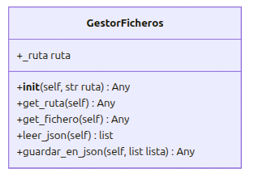

# Sistema de Gestión de un Centro Educativo

## Descripción del proyecto
Esta aplicación es un **Sistema de Gestión de un Centro Educativo** desarrollado en **Python**. Su objetivo principal es modelar de forma progresiva la lógica de negocio de una institución escolar, permitiendo administrar tanto al personal docente como al alumnado.
El sistema destaca por las siguientes funcionalidades implementadas:
- Gestión de usuarios: Permite la creación y almacenamiento de alumnos y profesores.
- Gestión de Asignaturas: Los alumnos pueden ser matriculados y es posible asignar o modificar sus calificaciones de forma dinámica.
- Modelo de Herencia y Polimorfismo: Utiliza una clase base abstracta Persona de la que heredan los distintos roles, permitiendo un tratamiento unificado de los datos pero con comportamientos específicos para cada tipo de usuario (por ejemplo, en su representación de texto __str__).
- Gestión Académica:
  * Matriculación: Los alumnos pueden ser matriculados en diferentes asignaturas.
  * Calificación: El sistema permite asignar notas a los alumnos validando que se encuentre la nota en el rango de 0 a 10 y debe ser realizada por el profesor con la especialidad en esa asignatura.
- Sistema de Validación Robusto: 
  * Control estricto de DNIs (formato 8 números + 1 letra).
  * Validación de rango de calificaciones (0-10).
  * DNIs únicos: verificacion en la creación/modificación del usuario asi como bloqueo en base de datos asignado como `UNIQUE` el campo dni.
  * Email únicos: verificacion en la creación/modificación del usuario asi como bloqueo en base de datos asignado como `UNIQUE` el campo email.
- Gestión de Excepciones: Implementación de errores personalizados (`DatoInvalido`, `Duplicado`,`BaseDeDatosError`) que permiten al programa continuar su ejecución ante datos corruptos, entradas duplicadas, errores en base de datos informando del error por consola y registrando en el log tales errores.
- Persistencia de Datos: Los datos de alumnos, profesores y asignaturas se almacenan en una base de datos mysql alojada en un contenedor docker, permitiendo que la información se mantenga entre distintas ejecuciones del programa.
- Operaciones CRUD Completas: Se ha implementado la capacidad de Crear, Leer, Actualizar y Borrar tanto para el personal docente como para el alumnado.
- Sistema de Logging: Registro automático de cada operación (altas, bajas, errores) en el archivo escuela.log, incluyendo marca de tiempo y estado de la tarea así como los errores que se producen durante la ejecución.

## Arquitectura y Modelo de Clases (UML)





## Estructura del proyecto
```
└── 📁gestion-escolar-python
    └── 📁app
        ├── __init__.py           # Facilita las importaciones del paquete
        ├── interfaz_usuario.py   # Gestor logica visual y conexion a centro educativo
    └── 📁datos                   # Paquete de Json's de almacenamiento en memoria datos
        ├── alumnos.json
        ├── asignaturas.json
        ├── profesores.json
    └── 📁escuela
        ├── __init__.py           # Facilita las importaciones del paquete
        ├── common.py             # Utilidades (validaciones, factorías, excepciones)
        ├── ficheros.py           # Gestor de ficheros json
        ├── gestion.py            # Clase CentroEducativo
        ├── modelos.py            # Definición de Persona, Alumno, Profesor y Asignatura
        ├── registrar.py
    └── 📁images                  # Imagenes documentacion
    ├── .gitignore
    ├── escuela.log               # Logs de la aplicacion
    ├── main.py                   # Script de prueba y ejecución
    └── README.md                 # Documentación de la aplicación
```

## Tecnologías Aplicadas:
* **Herencia y Polimorfismo**: Uso de clases abstractas para `Persona` y especialización de comportamientos en subclases.
* **Encapsulamiento**: Protección de atributos sensibles y acceso mediante decoradores o métodos getter/setter.
* **Tratamiento de excepciones personalizadas**: Implementación de un sistema de control de errores mediante clases de excepción propias (DatoInvalido, Duplicado, IntegridadDatos).
* **Persistencia de datos (JSON)**: Implementación de almacenamiento no volátil mediante la serialización y deserialización de objetos en formato JSON.
* **Gestión de logs**: registro de operaciones realizadas.

## Gestión de Persistencia
El sistema utiliza la clase GestorFicheros para la persistencia de los datos en el disco duro en formato ficheros JSON evitando la perdida de estos ante paradas de la aplicación.


Los datos de la aplicación serán guardados en memoria en tres ficheros dentro del directorio datos (`alumnos.json`, `profesores.json`y `asignaturas.json`) los cuales seran creados si no existen sin afectar al funcionamiento de la aplicación.

  - Lectura: Al iniciar, el sistema instancia los objetos Alumno, Profesor y Asignatura a partir de los diccionarios almacenados en los JSON alumnos.json, .
  - Escritura: Mediante el método to_dict() en los modelos, los objetos se serializan para ser guardados de nuevo en formato JSON cada vez que se produce una modificación en los datos de la apliación.  
  - Seguridad: Si los archivos de datos no existen, el sistema los crea automáticamente para evitar interrupciones en la ejecución.
  - Verificación datos: cuando se sale de la aplciación se verifica que los datos registrados en memoria (archivos json) coincide con los datos de la aplicación dando la posibilidad de rectificarlos o forzar el cierre de la aplicación asumiendo la perdida de datos no coincidentes con los ficheros json.

## Registro de Actividad (Logs)
El sistema emplea la clase Registrar para documentar cada acción relevante en escuela.log con el siguiente formato:  

[FECHA Y HORA] - [TAREA] - [ESTADO]

Ejemplos:
``` 
[2026-05-02 13:30:48] TAREA: Alta alumno | ESTADO: Alumno con dni '33333333C' dado de alta correctamente
[2026-05-02 13:30:58] TAREA: Alta profesor | ESTADO: ERROR: Usuario con dni: '33333333A'-> Ya existe en el centro
```

## Tutorial de uso
- **Requisitos**: Python version 3.xx
- **Docker**: Docker Desktop instalado y en funcionamiento.
- **Clonar repositorio** ```https://github.com/RubenToucedaPRO/gestion-escolar-python```
- **Situarse en la rama correspondiente**
- **Ejecucion**:
  - 1º- En primer lugar debemos levantar el contenedor, desde la terminal nos situamos en la carpeta del proyecto y ejecutamos el siguiente comando:
    * `docker compose up -d `
  - 2º- Ejecutar la aplicación, existen dos formas:
    * Opcion 1: Ejecutar el fichero main.py en VsCode
    * Opcion 2: Ejecutar desde la terminal en el directorio raiz del proyecto 'python main.py'
- **Borrar cotenedor**:
  En caso de querer borrar el contendor de la BD para crear uno nuevo con los datos iniciales utilizar el siguiente comando con la aplicación detenida:
    * ` docker compose down -v`
    * Después podemos realizar los pasos del apartado ejecución en caso de querer iniciar la aplicación de nuevo.
