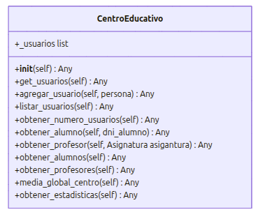

# Sistema de Gestión de un Centro Educativo

## Descripción del proyecto
Esta aplicación es un Sistema de Gestión de un Centro Educativo desarrollado en Python. Su objetivo principal es modelar de forma progresiva la lógica de negocio de una institución escolar, permitiendo administrar tanto al personal docente como al alumnado.
El sistema destaca por las siguientes funcionalidades implementadas en esta primera fase:
- Gestión de usuarios: Permite la creación y almacenamiento de objetos Alumno y Profesor dentro de un contenedor centralizado (CentroEducativo).
- Modelo de Herencia y Polimorfismo: Utiliza una clase base abstracta Persona de la que heredan los distintos roles, permitiendo un tratamiento unificado de los datos pero con comportamientos específicos para cada tipo de usuario (por ejemplo, en su representación de texto __str__).
- Gestión Académica:
  * Matriculación: Los alumnos pueden ser matriculados en diferentes asignaturas.
  * Calificación: El sistema permite asignar notas a los alumnos validando que se encuentre la nota en el rango de 0 a 10 y debe ser realizada por el profesor con la especialidad en esa asignatura.
- Sistema de Validación Robusto: 
  * Control estricto de **DNIs** (formato 8 números + 1 letra).
  * Validación de rango de **calificaciones** (0-10).
- Gestión de Excepciones: Implementación de errores personalizados (`DatoInvalido`, `Duplicado`) que permiten al programa continuar su ejecución ante datos corruptos o entradas duplicadas, informando del error por consola.
- Obtencion de estadisticas: en base a los datos almacenados podemos obtener estadisticas del centro:
  * Total de usuarios (profesores y alumnos)
  * Numero de profesores
  * Numero de alumnos
  * Nota media global del centro

## Arquitectura y Modelo de Clases (UML)




## Estructura del proyecto
```text
gestion_escolar-python/
├── escuela/                 # Paquete principal (Lógica de negocio)
│   ├── __init__.py          # Facilita las importaciones del paquete
│   ├── modelos.py           # Definición de Persona, Alumno, Profesor y Asignatura
│   ├── gestion.py           # Clase CentroEducativo
│   └── common.py            # Utilidades (validaciones, factorías, excepciones)
└── main.py                  # Script de prueba y ejecución (fuera del paquete)
```

## Tecnologías Aplicadas:
* **Herencia y Polimorfismo**: Uso de clases abstractas para `Persona` y especialización de comportamientos en subclases.
* **Encapsulamiento**: Protección de atributos sensibles y acceso mediante decoradores o métodos getter/setter.

## Tutorial de uso
- **Requisitos**: Python version 3.xx
- **Ejecucion**: existen dos formas de ejecutar la aplicacion:
    * Opcion 1: Ejecutar el fichero main.py en VsCode
    * Opcion 2: Ejecutar desde la terminal en el directorio raiz del proyecto 'python main.py'
