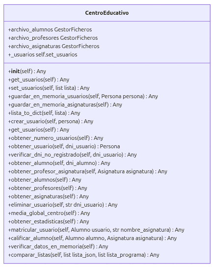
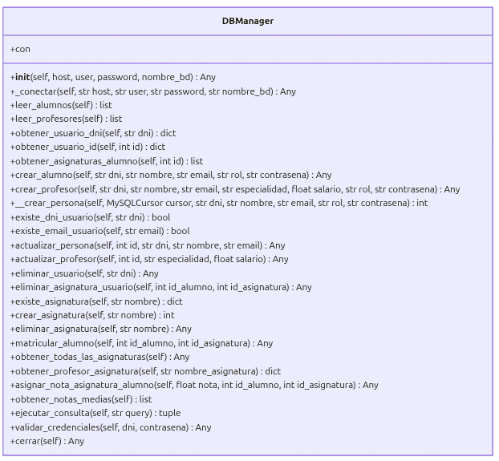
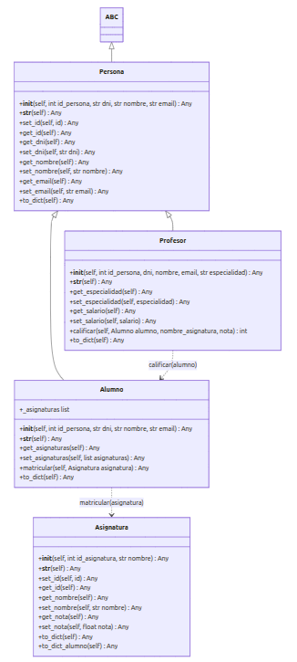
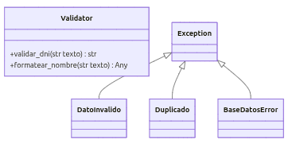
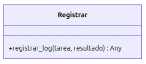
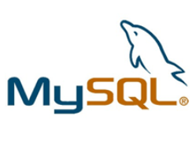
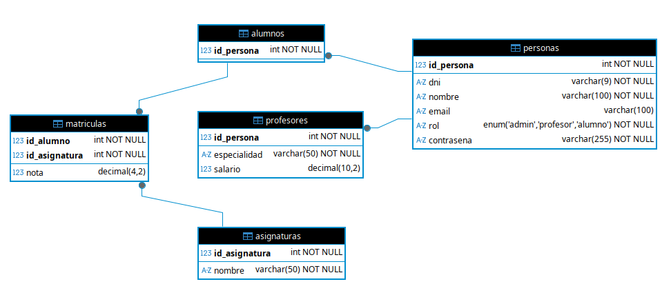
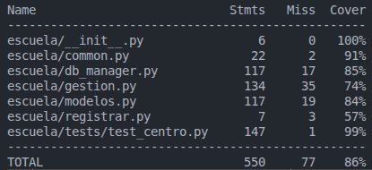
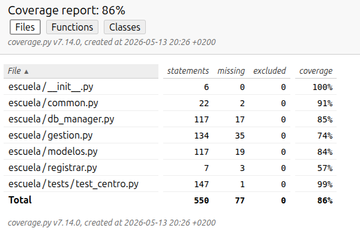

# Sistema de Gestión de un Centro Educativo

## Descripción del proyecto
Esta aplicación es un **Sistema de Gestión de un Centro Educativo** desarrollado en **Python**. Su objetivo principal es modelar de forma progresiva la lógica de negocio de una institución escolar, permitiendo administrar tanto al personal docente como al alumnado.

### Funcionalidades
El sistema destaca por las siguientes funcionalidades implementadas:

- **Autenticación y Control de Acceso Basado en Roles:**
  * **Sistema de Login y Sesiones:** Mecanismo de autenticación seguro mediante cookies de sesión en Flask que almacena la identidad (`dni`, `nombre`) y el rol del usuario para persistir el estado de la aplicación.
  * **Cierre de Sesión Seguro:** Destrucción completa del diccionario de sesión (`session.clear()`) para prevenir secuestros de sesión y accesos no autorizados tras el logout.
  * **Protección de Vistas mediante Decorador:** Implementación del decorador personalizado `@login_required(role=[...])` que restringe el acceso a endpoints específicos.

- **Gestión de Usuarios y Operaciones CRUD Completas:**
  * Capacidad de Crear, Leer, Actualizar y Borrar (CRUD) tanto para el personal docente como para el alumnado.
  * Tratamiento diferenciado de vistas e interfaces según los privilegios del rol autenticado (Administrador, Profesor, Alumno).

- **Gestión de Asignaturas:** Permite la declaración, registro y administración de las asignaturas impartidas por el centro docente por parte del administrador. Los profesores, alumnos y sin login podrán simplemente visualizar las asignaturas que imparte el centro.

- **Gestión de Matrículas y Calificaciones:**
  * **Matriculación Dinámica:** Capacidad de matricularse los alumnos en las diferentes asignaturas de las que dispone el centro evitando que el alumno pueda insertar manualmente el nombre de la asignatura.
  * **Calificación Académica:** El sistema permite asignar y modificar notas, validando que se encuentren estrictamente en el rango de 0 a 10 y que existe un profesor cuya especialidad es dicha asignatura.

- **Modelo de Herencia y Polimorfismo:** Utiliza una clase base abstracta `Persona` de la que heredan los distintos roles, permitiendo un tratamiento unificado de los datos en la lógica del sistema pero con comportamientos específicos para cada tipo de usuario (por ejemplo, en su representación de texto `__str__`).

- **Sistema de Validación Robusto:** 
  
  * Control estricto de formato de DNIs (8 números y 1 letra) mediante expresiones regulares y calculo de la letra de control oficial usando el módulo 23.
  * Validación estricta en el rango de calificaciones (0-10).
  * **Garantía de Unicidad:** Verificación dual (a nivel de aplicación durante la creación/modificación y a nivel de infraestructura mediante restricciones `UNIQUE` en la base de datos) para los campos `dni` y `email`.

- **Gestión de Excepciones:** Implementación de errores personalizados (`DatoInvalido`, `Duplicado`, `BaseDatosError`) que desacoplan el flujo principal de los fallos de infraestructura, permitiendo al programa continuar su ejecución ante datos corruptos, entradas duplicadas o caídas del motor de base de datos.

- **Persistencia de Datos:** Arquitectura de datos basada en un motor MySQL alojado en un contenedor Docker, garantizando la consistencia, integridad y persistencia de la información entre las distintas ejecuciones del servidor de aplicaciones.

- **Sistema de Logging y Trazabilidad:** Registro automático y centralizado de eventos críticos (altas, bajas, inicios de sesión, cierres de sesión y excepciones internas) en el archivo `escuela.log`, incluyendo marcas de tiempo y el estado contextualizado de cada tarea para auditoría y depuración.

- **Suite de Pruebas Automatizadas (Testing):** Cobertura de código mediante pruebas unitarias y de integración utilizando `unittest` y `mock.patch` para verificar de forma aislada e independiente tanto la lógica de negocio como el comportamiento de los endpoints HTTP frente a flujos de éxito y denegación de accesos.

## Arquitectura y Modelo de Clases (UML)
El diseño del software se basa en una **arquitectura modular organizada en capas**, siguiendo principios de alta cohesión y bajo acoplamiento. Esta estructura permite separar la lógica de presentación de la lógica de negocio y la persistencia, facilitando el mantenimiento evolutivo del sistema.

### Descripción de la Arquitectura

1.  **Capa de Presentación (`interfaz_usuario`)**: Gestiona la interfaz de usuario por consola, validando entradas y enviando peticiones al orquestador.
2.  **Capa de Negocio (`escuela.gestion`)**: Actúa como el núcleo del sistema (Clase `CentroEducativo`), donde se coordina la lógica operativa y el flujo de datos entre modelos y base de datos.
3.  **Capa de Persistencia (`escuela.db_manager`)**: Encargada de la comunicación con el servidor MySQL mediante consultas SQL parametrizadas.
4.  **Capa de Dominio (`escuela.modelos`)**: Define las entidades del sistema utilizando una jerarquía de clases.
5.  **Servicios Transversales (`common`, `registrar`)**: Proveen utilidades globales como validaciones, excepciones personalizadas y trazabilidad mediante logs.


### Diagramas de Clase

#### 1. Centro Educativo (Lógica de Negocio)
Orquestador principal del paquete `escuela` (`gestion.py`). Centraliza las operaciones del sistema y es consumido directamente por los Blueprints de la capa web para procesar las altas, bajas y listados de la comunidad educativa.



#### 2. DB Manager (Persistencia de Datos)
Implementación encargada de la conectividad con el contenedor Docker de MySQL (`db_manager.py`). Administra la ejecución de sentencias SQL, el mapeo de registros y el ciclo de vida de las conexiones del servidor.



#### 3. Modelos de Entidades
Representa la jerarquía de objetos de negocio (`modelos.py`). Se destaca el uso de **herencia** a partir de la clase base abstracta `Persona` (de la que heredan `Alumno`, `Profesor` y `Administrador`) y la composición con la entidad `Asignatura`.



#### 4. Utilidades y Validación (Common)
Módulo centralizado de herramientas de soporte (`common.py`). Define los métodos globales de validación estricta (formatos de DNI, restricciones de emails y excepciones personalizadas) compartidos por todo el sistema.



#### 5. Sistema de Logs y Auditoría
Subsistema de trazabilidad encargado del registro asíncrono de operaciones, accesos y excepciones en tiempo de ejecución (`registrar.py`), persistiendo los eventos directamente en el archivo `escuela.log`.




## Estructura del proyecto
```
└── 📁gestion-escolar-python
    └── 📁app                     # Paquete principal de la aplicación web (Flask)
        └── 📁routes              # Capa de control distribuida mediante Flask Blueprints
            ├── __init__.py       # Inicialización del paquete de rutas
            ├── alumnos.py        # Endpoints y gestión de negocio del alumnado
            ├── asignaturas.py    # Endpoints y administración de asignaturas
            ├── auth.py           # Sistema de autenticación, logout y decorador de roles
            ├── main.py           # Rutas genéricas e índice de la aplicación
            ├── profesores.py     # Endpoints y gestión del personal docente
        └── 📁static              # Archivos estáticos servidos por el servidor web
            └── 📁css              # Estilos de la interfaz de usuario
                └── 📁fonts       # Fuentes tipográficas del sistema
                ├── style.css     # Estilos personalizados de la plataforma
            └── 📁js              # Componentes de comportamiento interactivo front-end
            ├── favicon.png       # Icono de pestaña del navegador
        └── 📁templates           # Vistas html renderizadas mediante el motor Jinja2
            ├── _footer.html      # Fragmento reutilizable de pie de página
            ├── _navbar.html      # Barra de navegación dinámica según el rol de sesión
            ├── alumno_detalle.html
            ├── alumnos.html
            ├── asignaturas.html
            ├── editar_alumno.html
            ├── editar_profesor.html
            ├── estadisticas.html
            ├── index.html        # Dashboard principal post-autenticación
            ├── layout.html       # Plantilla base contenedora de todas las vistas
            ├── login.html        # Pantalla de acceso al sistema
            ├── nuevo_alumno.html
            ├── nuevo_profesor.html
            ├── profesor_detalle.html
            ├── profesores.html
            ├── sql_libre.html    # Panel de ejecución de consultas directas
        ├── extensions.py         # Instanciación y puente global del objeto de negocio (sistema)
    └── 📁escuela                 # Paquete principal de lógica de negocio (Core)
        ├── __init__.py           # Facilita las importaciones del subpaquete
        ├── common.py             # Herramientas de validación de datos comunes (DNI, email, excepciones)
        ├── config.py             # Configuración del entorno de la aplicación
        ├── db_manager.py         # Capa de persistencia (Transacciones nativas SQL con MySQL)
        ├── gestion.py            # Implementación de la clase controladora CentroEducativo
        ├── modelos.py            # Jerarquía de clases (Persona, Alumno, Profesor, Asignatura)
        ├── registrar.py          # Infraestructura de logging y trazabilidad
    └── 📁images                  # Gráficos y diagramas para la documentación del repositorio
    └── 📁scripts
        ├── init_db.sql           # Script de creación de tablas y datos iniciales
    ├── .gitignore                # Archivos excluidos de control de versiones
    ├── docker-compose.yml        # Orquestación del contenedor MySQL
    ├── escuela.log               # Logs de la aplicación
    ├── main.py                   # Punto de entrada principal de la aplicación
    ├── README.md                 # Documentación de la aplicación
    └── requirements.txt          # Dependencias (mysql-connector, coverage, etc.)
```

## Tecnologías y conceptos aplicados

* **Desarrollo Web y Arquitectura de Software**:
    * **Flask y Blueprints**: Implementación de una arquitectura web modular mediante el uso de Flask Blueprints, distribuyendo de forma limpia las responsabilidades del enrutamiento por componentes de negocio (`auth`, `alumnos`, `profesores`, `asignaturas`).
    * **Patrón MVC / Capas**: Clara separación de responsabilidades dividida entre la capa de presentación (vistas HTML estructuradas con herencia de plantillas en Jinja2), la capa de control (endpoints y decoradores en las rutas) y el núcleo de lógica de negocio y persistencia en el paquete `escuela`.
    * **Manejo de Sesiones HTTP**: Gestión del estado de la aplicación e identidad del usuario mediante el ciclo de vida de sesiones basadas en cookies firmadas criptográficamente por Flask.
* **Seguridad y Control de Acceso**:
    * **Control de acceso**: Sistema de control de accesos basado en roles (Administrador, Profesor, Alumno).
    * **Inyección de Dependencias en Flujos (Decoradores)**: Diseño del decorador personalizado de funciones `@login_required(role=[...])` para interceptar peticiones HTTP en tiempo de ejecución, encapsulando la lógica de autorización y protegiendo las vistas de accesos no autorizados.
* **Programación Orientada a Objetos (POO) Avanzada**:
    * **Herencia y Polimorfismo**: Implementación de una jerarquía de clases con `Persona` como base y especialización en `Alumno` y `Profesor`, permitiendo un tratamiento uniforme de las entidades.
    * **Encapsulamiento**: Protección del estado interno de los objetos mediante atributos privados y acceso controlado a través de métodos *getter* y *setter*.
* **Capa de Persistencia y Bases de Datos**:
    * **MySQL Relacional**: Diseño de un esquema de base de datos con relaciones de clave foránea (Foreign Keys) para gestionar alumnos, profesores, asignaturas y matrículas.
    * **Patrón de Conectividad Estricto**: Gestión nativa de transacciones SQL, cursores y control de excepciones operacionales de base de datos.
* **Arquitectura de Software**:
    * **Patrón de Capas**: Separación clara entre la interfaz de usuario (presentación), la lógica de negocio (CentroEducativo) y la gestión de datos (DBManager).
* **Robustez y Mantenibilidad**:
    * **Gestión de Excepciones Personalizadas**: Sistema de control de errores propio (`DatoInvalido`, `Duplicado`, `BaseDatosError`) para capturar fallos lógicos antes de que lleguen a la capa de persistencia.
    * **Logging**: Registro sistemático de eventos y errores mediante el módulo `logging` de Python para facilitar la trazabilidad.
* **Infraestructura y Calidad**:
    * **Contenerización con Docker**: Despliegue de la infraestructura de base de datos mediante `docker-compose`, garantizando un entorno de desarrollo reproducible.
    * **Testing e Integración**: Suite de pruebas automatizadas con `unittest` para probar la lógica contra la base de datos real con datos ficticios que se eliminan al final de cada test.
    * **Análisis de Cobertura (Coverage)**: Control e inspección métrica del alcance de las pruebas utilizando `coverage`, evaluando activamente las sentencias ejecutadas y detectando líneas de código no cubiertas (*Miss*).

## Gestión de Persistencia

El sistema delega la persistencia de datos en un sistema de gestión de bases de datos relacionales **MySQL**, eliminando la dependencia de ficheros locales y garantizando la integridad de la información mediante el cumplimiento de las propiedades ACID (Atomicidad, Consistencia, Aislamiento y Durabilidad).



La persistencia se articula a través de la clase `DBManager`, que actúa como capa de acceso a datos (DAO), gestionando la conexión con el servidor MySQL desplegado en un contenedor **Docker**.

* **Conectividad**: La aplicación utiliza el driver `mysql-connector-python` para establecer una comunicación persistente con la base de datos, configurada mediante variables para facilitar su despliegue.
* **Modelo Relacional**: Los datos se organizan en tablas normalizadas (`personas`, `alumnos`, `profesores`, `asignaturas` y `matriculas`), relacionadas mediante claves foráneas (Foreign Keys) que aseguran la integridad referencial.



* **Operaciones CRUD**:
    * **Lectura**: El sistema ejecuta sentencias `SELECT` y mapea los resultados de los cursores a objetos de las clases `Alumno` o `Profesor`.
    * **Escritura**: Las altas y modificaciones se realizan mediante sentencias `INSERT` y `UPDATE`. Se emplea el uso de transacciones con `commit()` para asegurar que los cambios se guarden de forma permanente.
* **Seguridad e Integridad**: Se hace uso de restricciones de base de datos (`UNIQUE`, `NOT NULL`) para validar los datos a nivel de esquema, complementando las validaciones lógicas de la aplicación.
* **Inicialización**: El sistema cuenta con un script de automatización `init_db.sql` que define la estructura de las tablas y los datos semilla, asegurando que el entorno esté listo para su uso desde el primer despliegue en Docker.

## Registro de Actividad (Logs)
El sistema emplea la clase Registrar para documentar cada acción relevante en escuela.log con el siguiente formato:  

[FECHA Y HORA] - [TAREA] - [ESTADO]

Ejemplos:
``` 
[2026-05-02 13:30:48] TAREA: Alta alumno | ESTADO: Alumno con dni '33333333C' dado de alta correctamente
[2026-05-02 13:30:58] TAREA: Alta profesor | ESTADO: ERROR: Usuario con dni: '33333333A'-> Ya existe en el centro
```


## Calidad y Testing

Se ha implementado una suite de pruebas automatizadas para validar la lógica de negocio, garantizando la integridad del sistema y facilitando la detección de posibles regresiones en futuras modificaciones del código.

### Estrategia de Pruebas
Se han desarrollado **tests de integración** que interactúan directamente con la base de datos MySQL desplegada en el entorno de Docker. Para asegurar las pruebas (permitiendo su ejecución repetida sin conflictos), se ha implementado una política de limpieza de datos creados: cada test se encarga de eliminar los registros creados al finalizar su ejecución mediante llamadas explícitas a métodos de borrado.

### Ejecución de los Tests
Para lanzar la suite de pruebas completa, sitúese en la terminal dentro de la raíz del proyecto y ejecute el siguiente comando:
* Si su sistema operativo es windows:
```bash
python -m unittest discover -s tests
```
* Si su sistema operativo es Linux/MacOS
```bash
python3 -m unittest discover -s tests
```

### Análisis de Cobertura
El proyecto integra la herramienta **Coverage** para medir con precisión qué porcentaje del código fuente ha sido ejecutado y validado por las pruebas.

#### **Reporte rápido en terminal:**
1. **Generar datos de cobertura:** el siguiente comando generará un fichero `.coverage`el cual luego con el comando del paso 2 podremos visualizar.
* Si su sistema operativo es windows:
```bash
python -m coverage run -m unittest discover -s tests
```
1. **Visualización reporte:**
```bash
python -m coverage report
```
* Si su sistema operativo es Linux/MacOS:
```bash
python3 -m coverage run -m unittest discover -s tests
```
1. **Visualización reporte:**
```bash
python3 -m coverage report
```




#### **Reporte detallado en HTML:**
Para un análisis visual exhaustivo que permite identificar línea a línea las partes del código no probadas por ficheros, funciones o clases:
1. **Generar el sitio web de reporte:** el siguiente comando generará un directorio `htmlcov/` en el cual dispondremos del reporte de covertura en formato web.
```bash
python3 -m coverage html
```
2. **Localizar los archivos:** Se creará una carpeta llamada `htmlcov/` en la raíz.
2. **Visualización:** Abra el archivo `index.html` en cualquier navegador web.




## Tutorial de Uso

Siga estos pasos para configurar y ejecutar el entorno de gestión escolar en su máquina local.

### Requisitos Previos
* **Python**: Versión 3.12 o superior.
* **Docker**: Docker Desktop instalado y en ejecución.

### Paso 1: Preparación del Entorno
Clone el repositorio e instale las dependencias necesarias:

```bash
git clone https://github.com/RubenToucedaPRO/gestion-escolar-python
```
Situese en la rama correspondiente:
```bash
git checkout rama-tarefa4
```
Abra en su ide el proyecto y proceda con los siguientes pasos de creación y activacion del entorno virtual:
* Si su sistema operativo es windows:
```bash
python -m venv .venv
.venv\Scripts\activate
```
* Si su sistema operativo es Linux/MacOS
```bash
python3 -m venv .venv
.venv\Scripts\activate
```

Con el entorno virtual activado (verá el nombre .venv en su terminal), instale las librerías necesarias con el siguiente comando:

```bash
pip install -r requirements.txt
```

### Paso 2: Despliegue de Infraestructura (Docker)
Levante el contenedor de la base de datos. Este proceso inicializa automáticamente las tablas necesarias:
```bash
docker compose up -d
```

### Paso 3: Ejecución
Inicie la aplicación:
* Opcion 1: Ejecutar el fichero **server.py** en VsCode.
* Opcion 2: Abra la terminal, situese en la raiz del proyecto y ejecute el siguiente comando: 
  - Si su sistema operativo es windows:
```bash
# Ejecución vía terminal
python server.py
```
  - Si su sistema operativo es Linux/MacOS
```bash
# Ejecución vía terminal
python3 server.py
```

### Paso 4: Mantenimiento y Reseteo
Si desea borrar todos los datos y volver al estado iniciar del script SQL, elimine los volúmenes del contenedor:
```bash
docker compose down -v
```
